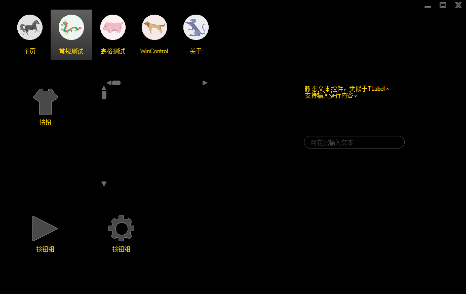
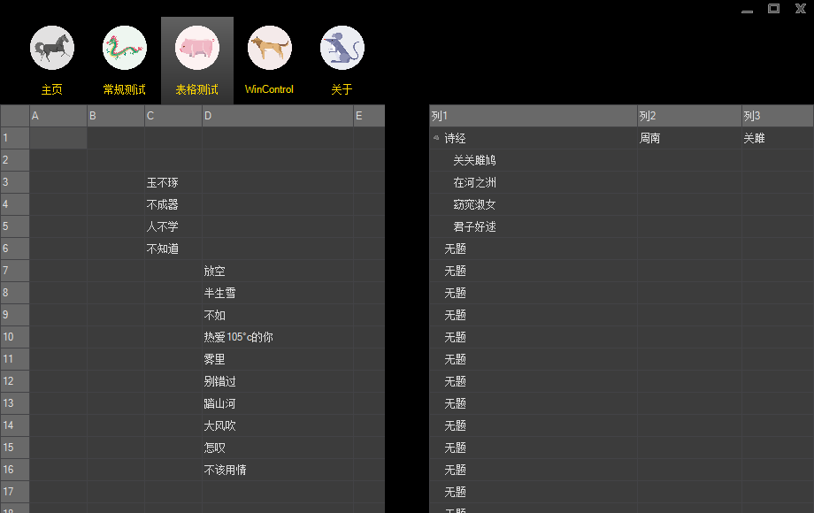
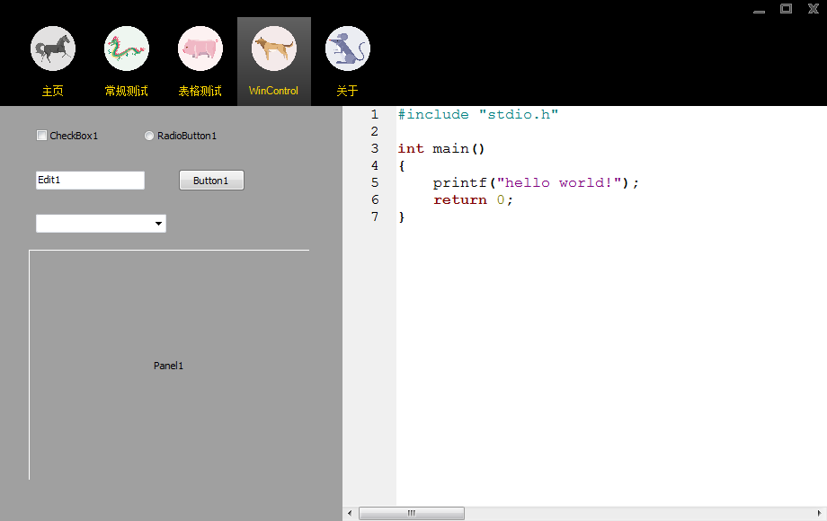
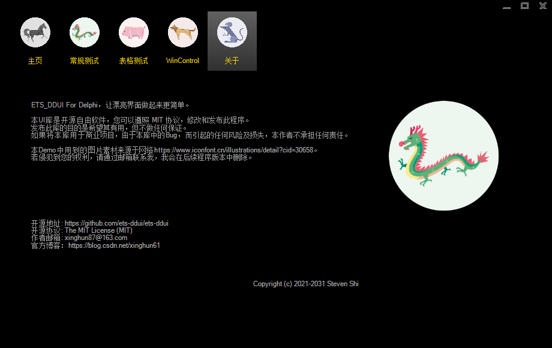
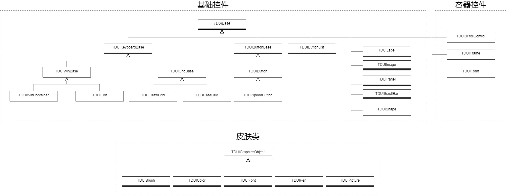
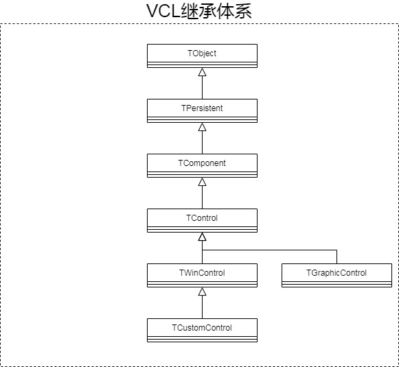
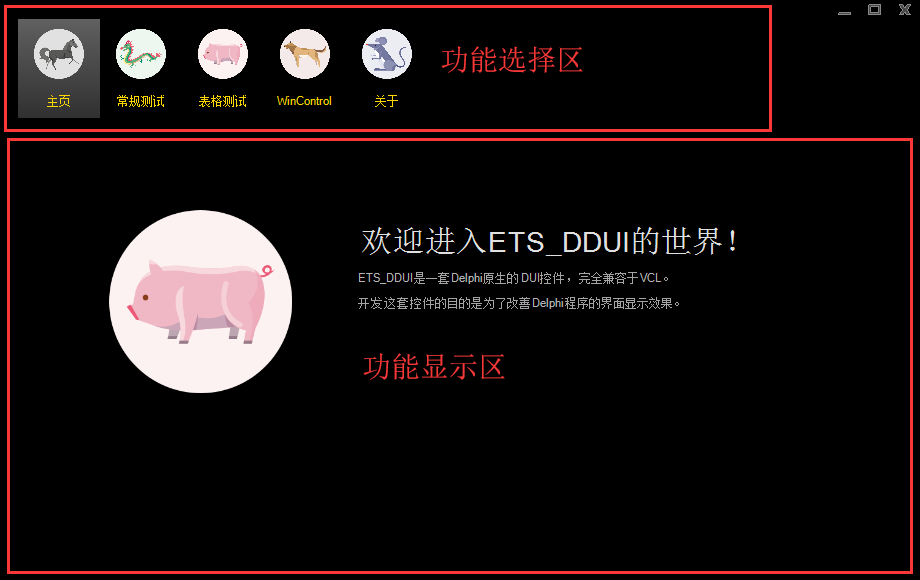

[TOC]

# 简介

`ETS_DDUI`是一套Delphi原生的DUI控件，完全兼容于VCL，开发这套控件的目的是为了改善Delphi程序的界面显示效果。

## 效果图

Demo程序借鉴了360的设计。

此页面是对目前已支持的DUI控件的测试样例。

此页面是表格控件的测试样例。

此页面中展示的控件并不是DUI控件，而是Delphi的常规控件，用于演示如何将常规控件用到DUI的框架中。
右侧用到的编辑器是开源的`Scintilla`，需要自行编译出DLL文件，放到Demo二进制程序的同级目录中，更简单的方式是下载最新的`Notepad++`，然后，拷贝其中的`SciLexer.dll`文件即可。

## 现状分析

在网上搜了下，还真找到几个不错的开源DUI控件库，主要以C++的居多，Delphi的有一个，但核心还是基于C++的版本。

* **DuiLib**: 这是我很久以前就听说过的版本，最初好像是一个丹麦的大神写的一个Demo，之后DuiLib的作者以其为基础做了完善，据说很多大厂的产品中都用到过这个库，但可惜作者已经弃坑了，[源码地址](https://github.com/duilib/duilib)。
* **DDuilib**: 这是我在网上找到的唯一一个Delphi的DUI库，本质上只是对DuiLib的二次包装，核心还是基于C++，[源码地址](https://github.com/ying32/duilib-for-Delphi)。
* **DuiVision**: 看起来很强大的一个库，也是C++写的，[源码地址](https://github.com/blueantst/DuiVision)。

和这些开源库相比，感觉`ETS_DDUI`要走的路还很长，目前实现了一个基本框架和一些基础控件，算是在Delphi中开发DUI界面的另一个选择吧。

## DDUI控件全景图

# 设计原理

## Delphi中的UI设计

其实，从Delphi本身而言，是支持DUI控件的，我们先来看看VCL的类继承体系。

Delphi中的控件可以分为三大类：

* 从TComponent直接继承，这类控件不带有界面外观，常见的如数据库相关控件。
* 从TControl直接继承，这类控件实际上就是**DUI控件**，控件不会创建窗口句柄。
* 从TWinControl继承，这类控件就是最常见的带窗口句柄的控件，后文我会将这类控件叫做**GUI控件**。

如果我们引入一套新的控件，直接从TControl继承，那么，这些控件就天然是DUI控件了。
但Delphi在设计上有个很大的限制，那就是Parent这个属性，被定义为TWinControl类型。
也就是说，DUI控件只能放在GUI控件之上，DUI控件本身不能叠加摆放。
这样一来，在功能设计时，程序模块化不太好做。

例如，如下图所示：

我们将窗口划分为两个区域，上边是功能选择区，下边是功能显示区。
由于不同的功能，显示区要展示的内容都不同，因此，我一般会把显示区提取出来，单独用TFrame实现。
当选择不同的功能时，就把不同的TFrame贴到显示区中。
但因为前面说到的Delphi的限制，TFrame就必须是TWinControl控件，这样一来，就无法完全做到无窗口句柄的效果。

## 区分“设计时”和“运行时”

ETS_DDUI解决这个问题的办法是区分设计时和运行时。
ETS_DDUI构建完成后，会生成两个bpl文件：**dclDDUI.bpl**和**DDUI.bpl**。
两个bpl共用同一套代码，但前者从TWinControl继承，后者从TControl继承。
在Delphi IDE环境中，我们安装dclDDUI.bpl，但在我们自己的程序中，我们链接DDUI.bpl。
这样一来，在Delphi IDE中，创建的控件实际上都是GUI控件，我们就能享受到Delphi窗口设计器所带来的诸多好处。
而在运行时，创建的是DUI控件，这样就能实现无句柄的效果。

## GDI VS GDI+

Delphi中的绘图类是TCanvas，其本身是对Windows的GDI API做的包装。
但GDI对颜色的Alpha通道支持得非常有限，所以，在实现半透明、颜色渐变等效果时，会比较麻烦。
所以，ETS_DDUI在设计时，直接抛弃了TCanvas，改为使用GDI+。

## 消息分发

DUI和GUI的最大区别，本人认为就是在消息分发上。
GUI由于具有窗口句柄，因此，控件本身会自动产生各类消息。
DUI由于是模拟出来的，因此，消息全部由最底层的主窗口产生，然后一层层的往上分发。

常见的消息可分为三类：

* 绘图消息(WM_Paint)，处理时，由主窗口最先绘制，然后，上层的DUI控件再一层层的按叠放顺序绘制。
* 鼠标消息(WM_MOUSEFIRST~WM_MOUSELAST)，和绘图消息的处理顺序刚好相反，先将消息分发到上层控件处理，如果上层控件不处理，下层控件才处理。
* 键盘消息(WM_KEYFIRST~WM_KEYLAST)，主窗口要跟踪记录获取焦点的控件，处理时，直接将消息分发到焦点控件。

## 皮肤

很多使用DUI控件开发的程序，都有类似**换肤**的功能，所以，在DUI控件中引入对皮肤的支持，还是有必要的。
对**皮肤**的实现，简单点说，就是将颜色、画刷、图片等绘图要素，统一放到一起管理。
每个绘图要素都有一个唯一的名称，DUI控件在绘制界面时，通过名称取用。

ETS_DDUI将绘图要素分为五个大类进行管理：TDUIBrush、TDUIColor、TDUIFont、TDUIPen、TDUIPicture。
相关的配置信息放在"Skin.json"文件中保存，加载时，通过RTTI机制，从json文件中读取属性，创建相应的绘图要素的对象实例。
而**换肤**的功能，实际上就是切换json文件后，重新加载的过程。

## TDUIWinBase

Delphi中存在大量的TWinControl控件，如果弃之不用，着实可惜。
但TWinControl无法直接放到DUI控件上使用，因为DUI控件没有窗口句柄，无法设置为父窗口。
因此，引入了TDUIWinBase基类，其对TWinControl重新做了层包装，使其可以当成DUI控件使用。
根据Delphi控件的不同特性，可分为容器类和控件类这两套分支体系。

### 容器类

容器类仅提供了一个实现**TDUIWinContainer**。
本质上只是对TFrame的包装，这样，就可以直接在上面放置TWinControl、TControl等常规控件。

> 由于TFrame不会自绘背景，目前代码中包装的是自定义的控件，但实现上参考了TFrame的实现。

### 控件类

目前仅实现了一个**TDUIEdit**，对TEdit做的包装，提供简单文本的输入功能。

### Scintilla

Scintilla并不属于ETS_DDUI控件集的范畴，只不过因为其功能比较强大，因此，才引入进来。
可能很多同学并没听说过这个控件，但Notepad++相信不少人听说过吧，而Notepad++底层就是用的Scintilla，是其最核心的文本编辑器。
而ETS_DDUI也对这个控件做了一层简单包装(TScintilla)，作为TRichEdit的替代品使用。

# 后续工作

1. 带弹出窗口的控件，例如，组合框、弹出菜单等。
2. 复选框、单选框。
3. 皮肤编辑器。

# 联系作者

* 邮箱: [xinghun87@163.com](xinghun87@163.com)
* 博客：[https://blog.csdn.net/xinghun61](https://blog.csdn.net/xinghun61)
