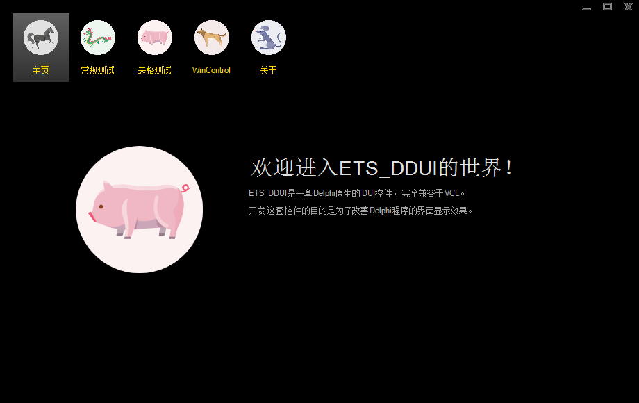

[TOC]

# ETS_DDUI

## 介绍

`ETS_DDUI`是一套Delphi下使用的DUI控件库，完全兼容VCL。

`ETS_DDUI`分为两部分：

* **ETS**: 全名叫“Extended Tool Set”(可扩展工具集)，最初是为了测试js引擎而写的，后来重新做了包装，当单元测试工具来用，通过脚本扩展程序功能。
* **DDUI**: 全名叫“Delphi's Direct UI For ETS”，是一套Delphi下使用的DUI控件库，最初是为ETS写的，用于改善Delphi的界面显示效果，可独立使用。

> 由于在网上找到一个未开源的同名库(只有一个文档而已)，也叫DDUI，为避免混淆，本库的名字改为了`ETS_DDUI`。

由于ETS中包含一些特殊代码不能开源，因此，计划将这部分剔除后，再开放相关源码。
本次开放的DDUI部分，可作为独立控件单独使用，理论上与Delphi的VCL库兼容。

## 效果图

# 程序构建

## 环境准备

* **操作系统**
  Windows 7及以上版本的操作系统。
* **Delphi2007**
  本库在Delphi2007中开发完成，因为用到运算符重载的语法，因此，Delphi7是不支持的。
  针对Delphi XE系列，因为一些公共的单元文件CodeGear做得不兼容，所以，理论上也不支持。
* **.Net 2.0**
  在安装Delphi2007时，理论上会自动安装，在构建程序时，会使用到`MsBuild.exe`。

## 编译

可使用两种方式构建程序，一种是在Delphi IDE下直接打开工程文件进行编译，另一种是使用MsBuild，在命令行下编译。

> Delphi IDE本质上也是使用MsBuild进行程序构建的。

### IDE编译

1. 打开Delphi IDE，在菜单【Tools->Options】中，设置一些全局参数
   【Environment Options->Environment Variables】，新增两个环境变量`BinDir`、`BuildRelation`
   * **BinDir**: 程序生成目录的根目录，例如，设置为"D:\ETS_Out"
   * **BuildRelation**: 关联编译开关，建议设置为"YES"，设置后，在编译`dclDDUI`工程时，会自动编译`DDUI`工程

   【Environment Options->Delphi Options->Library - Win32】，设置bpl的生成目录
   * **Package output directory**: 设置为`$(BinDir)\Component`
   * **DCP output directory**: 设置为`$(BinDir)\Component`
2. 打开工程"Delphi\DDUI\dclDDUI.dpk"，执行菜单【Project->Build all projects】编译程序

若一切正常，则会在"BinDir"所指向的目录中生成最终文件。

> Delphi默认维护的工程文件有很多冗余信息，所以，我将冗余的内容移到了"ETS.props"、"ETS.End.props"中进行管理。
>
> 但Delphi IDE无法正确识别这些自定义的内容，从而造成在IDE工程配置菜单中，无法正确显示相关参数，代码调试也会有些问题。
>
> 另一方面，如果在IDE中修改了工程文件配置，会覆盖掉自定义内容，有可能导致编译出错。

### 命令行编译

修改文件`build.bat`，为`path`、`BDS`设置正确的参数值。

* **path**: 需要将MsBuild程序所在的路径添加到列表中
* **BDS**: 设置为Delphi的安装目录

双击`build.bat`开始编译，如果执行成功，会在`Out`目录中生成执行结果。

### 编译Demo程序

如果单独编译Demo程序，有可能因为找不到资源文件而报错。
问题根源，本人觉得算是编译器对资源文件支持不是太好吧。
其`{$R}`预编译指令，无法自动将`.rc`文件，编译成`.res`后，再链接到程序中。
虽然将编译后的`.res`文件上传到源码库，可以解决问题，但本作者又不太愿意，看着这些冗余文件，有点刺眼。
所以，如果想单独编译Demo，或者是直接在其他程序中使用本库中的代码，建议先用前面的方法编译一次DDUI库，就会生成资源文件。

## 安装

编译后，会生成两个文件`dclDDUI.bpl`、`DDUI.bpl`。

* **dclDDUI.bpl**: 设计时程序，通过菜单【Component -> Install Packages】安装到Delphi IDE中使用
* **DDUI.bpl**: 运行时程序，使用DDUI开发的程序，在执行过程中，就是加载的此bpl

# 相关链接

* 作者邮箱: xinghun87@163.com
* 作者博客：[https://blog.csdn.net/xinghun61](https://blog.csdn.net/xinghun61)
* 设计原理介绍：[原理介绍](Doc/ETS_DDUI介绍.md)
